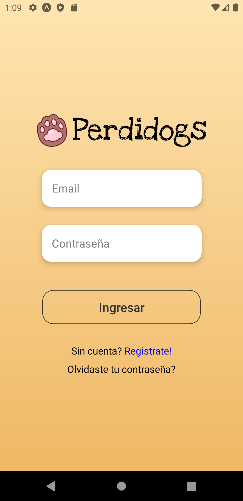
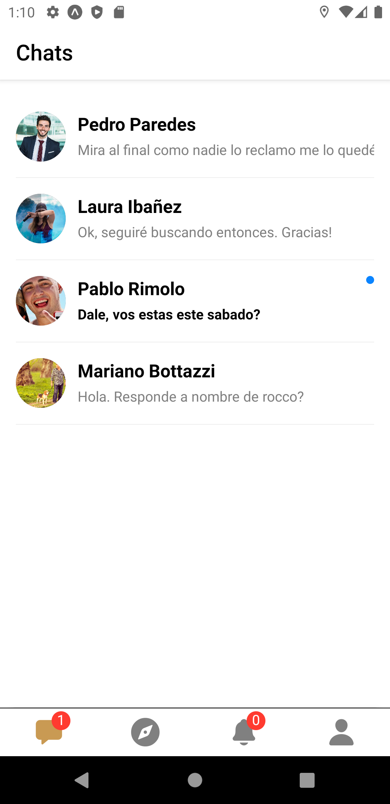
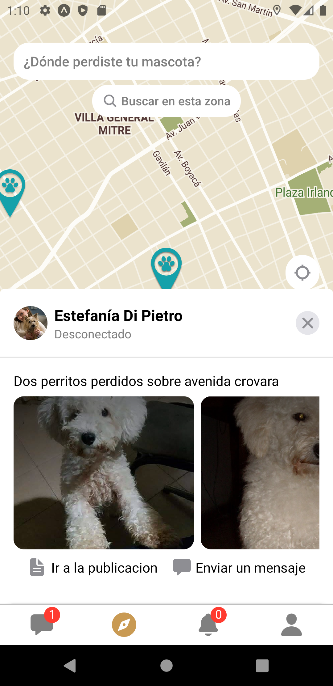
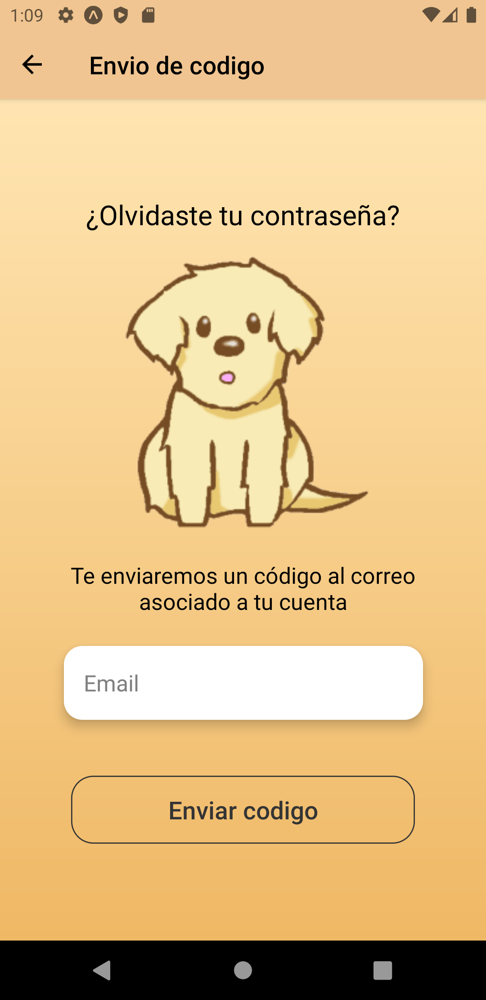

# Perdidogs 

Esta aplicacion fue creada como proyecto final en la Universidad de San martin, el objetivo de la misma es
centralizar las busquedas de nuestras queridas mascotas.

El servidor fue desarrollado en Node.js con una base de datos en MySQL, mientras que el front-end fue realizado en React Native.

La aplicacion cuenta con conexiones a distintas api's de Google, para poder utlizar la busqueda predictiva de localizaciones y tambien
la ubicacion geografica de las mascotas. 

###### El codigo se encuentra en el branch develop

Algunas caracteriscas a destacar:

* Modo oscuro - claro
* Servicio de mensajeria dentro de la aplicacion
* Notificaciones sobre alertas
* Busqueda predictiva de localizaciones utilizando api's de Google
* Conexion de Cloudinary para el manejo de imagenes
* UX intuitiva, modales que responden a eventos

## Algunas imagenes

## Login

## Chats

## Post preview

## Recuperacion

